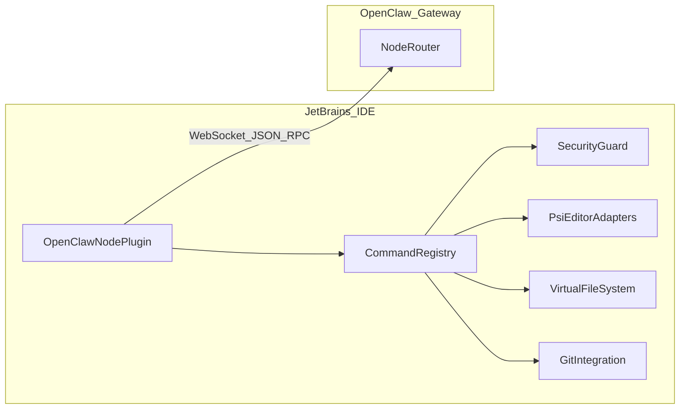

# JetBrains / PyCharm plugin (future) — specification

This document defines a **future IntelliJ Platform plugin** that connects PyCharm (and other JetBrains IDEs) to **OpenClaw Gateway** as a **Node**, mirroring the capabilities and safety posture of the existing VS Code extension ([openclaw-vscode](https://github.com/xiaoyaner-home/openclaw-vscode)).

## Goals

- **Parity** with the VS Code node for core coding-agent workflows: context, file I/O, search, language intelligence, diagnostics, git.
- **Protocol alignment**: reuse the same conceptual framing as upstream: WebSocket connection to the gateway, `node.invoke.request` / response style dispatch, command registry.
- **Safe defaults**: read-only first, explicit write confirmation, path scoping to project roots, terminal off by default.

## Non-goals (initial releases)

- Feature parity with every VS Code-specific command on day one.
- Arbitrary shell execution without an allowlist.
- Remote gateway exposure without documented hardening.

## Architecture

### Modules (suggested Kotlin packages)

| Package / class | Responsibility |
| --- | --- |
| `gateway.GatewayClient` | WebSocket connect, auth header/token, heartbeat, reconnect, serialize RPC |
| `protocol.Messages` | Data classes for invoke request/response (align field names with upstream where feasible) |
| `commands.CommandRegistry` | Map command string → suspend handler |
| `security.SecurityGuard` | Enforce project roots, read-only flag, confirm writes, terminal allowlist |
| `adapters.workspace.WorkspaceCommands` | `workspace.info` |
| `adapters.editor.EditorCommands` | `editor.context`, `editor.openFiles`, selections |
| `adapters.file.FileCommands` | `file.read`, `file.write`, `file.edit`, `file.delete`, `file.list` |
| `adapters.search.SearchCommands` | `search.text` |
| `adapters.lang.LangCommands` | `lang.definition`, `lang.references`, `lang.rename`, `lang.symbols` |
| `adapters.diag.DiagnosticsCommands` | `diagnostics.get` |
| `adapters.git.GitCommands` | `git.status`, `git.diff` (optional `git.log`) |
| `ui.SettingsPanel` | Gateway host, port, token, toggles |
| `ui.ActivityToolWindow` | Optional: log of invoked commands (parity with VS Code panel) |

## Command surface (v1 target)

Naming follows the VS Code node for familiarity. JetBrains-specific details live in JSON params/results.

### `workspace.info`

**Params**: none.

**Result** (example shape):

- `projectName`
- `contentRoots[]` (paths)
- `modules[]` (ids)
- `languageIds[]` (best-effort from module facets)

### `editor.context`

**Params**: none.

**Result**:

- `activeFile` (path or null)
- `caret` `{ line, column }`
- `selections[]` `{ startLine, startColumn, endLine, endColumn, text }`

### `file.read`

**Params**: `{ path: string }`

**Result**: `{ content: string, encoding: "utf-8" }`

### `file.write`

**Params**: `{ path: string, content: string }`

**Guards**: write confirmation unless trusted workspace.

### `file.edit`

**Params**: `{ path: string, edits: Edit[] }` where `Edit` is a minimal range + replacement strategy (start with full-line or document patch chunks; avoid ambiguous partial patches).

### `file.delete` / `file.list`

**Params**: path + optional recursive for list.

### `search.text`

**Params**: `{ query: string, caseSensitive?: boolean, regex?: boolean, pathGlob?: string }`

**Result**: `{ matches: { path, line, column, lineText }[] }` with sane caps.

### `lang.definition` / `lang.references`

**Params**: `{ path, line, character }`

**Implementation**: PSI `gotoDeclaration` / `findUsages` bridges.

### `lang.rename`

**Params**: `{ path, line, character, newName }`

**Guard**: confirm + single-file rename first; multi-file rename later.

### `lang.symbols`

**Params**: `{ path?, query? }`

### `diagnostics.get`

**Params**: `{ scope: "active" | "open" | "project", path?: string }`

### `git.status` / `git.diff`

**Params**: diff optional `path`, `staged`.

## Security model

### Path scoping

- Resolve all paths under `Project.getBasePath()` content roots using `LocalFileSystem` / `VirtualFile`.
- Reject `..` escapes and non-project files.

### Read-only mode

- Registry rejects mutating commands when read-only is on.

### Write confirmation

- First write in a session prompts; optional “trust this workspace for session” checkbox.

### Terminal (optional, later)

- Default **disabled**.
- If enabled: **allowlist only** (exact command strings or argv[0] + prefix rules documented).

## UX

- **Settings**: host, port, TLS, token, display name, read-only, confirm writes, terminal allowlist.
- **Status bar widget**: connected / degraded / disconnected.
- **Tool window** (optional): last N invocations with parameters redacted.

## Milestones

| Milestone | Deliverable |
| --- | --- |
| A | Connect + authenticate; `workspace.info`; ping/health |
| B | `editor.context` + `file.read` (Ask/Plan sufficient) |
| C | `file.write` / `file.edit` with confirmation (Agent edits) |
| D | `search.text` + `diagnostics.get` |
| E | PSI `lang.*` + `git.status` / `git.diff` |

## Testing strategy

- **Headless command tests** where possible: registry handlers with `LightPlatformCodeInsightFixtureTestCase` or newer fixture APIs.
- **Golden-file tests** for `file.edit` patch application on sample projects.

## Packaging and distribution

- Private channel first (zip / local plugin repo).
- Later: JetBrains Marketplace listing with clear security notes.

## Open questions (resolve before coding)

- Canonical JSON schema for invoke messages (pin to OpenClaw gateway version).
- Whether to share a Kotlin multiplatform **protocol** module with any other client (optional).

## References

- VS Code node README: <https://github.com/xiaoyaner-home/openclaw-vscode/blob/main/README.md>
- OpenClaw gateway CLI: <https://docs.openclaw.ai/cli/gateway>
